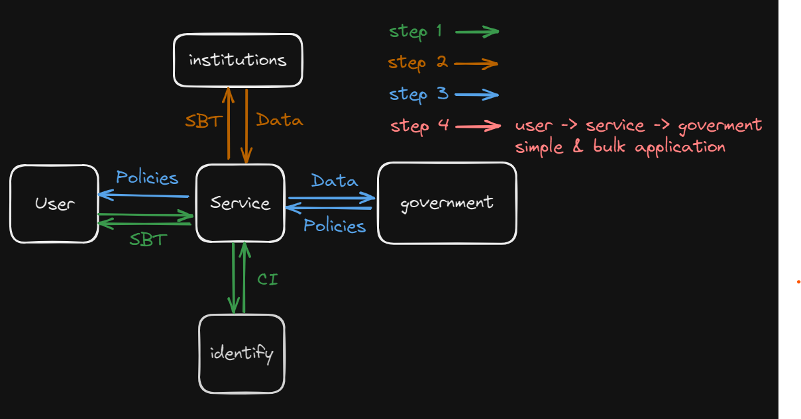

# Welfare policy recommendation with SBT

-  Customized welfare policy recommendation and simplified support service using SBT

## Team Member

Product Designer : 박이철

UX / UI Desginer : 이지우

Developer : 정지원, 이정윤

## Stack

Front-end : React

Blockchain : Solidity, ERC721 - SBT

EnCryption : AES protocol (crypto-js)

## hardhat dependencies

npm install --save-dev @nomiclabs/hardhat-etherscan@^3.1.0
npm install --save-dev @cronos-labs/hardhat-cronoscan
npm install ethers dotenv @openzeppelin/contracts
npm install --save-dev solidity-coverage
npm install --save-dev hardhat-gas-reporter
